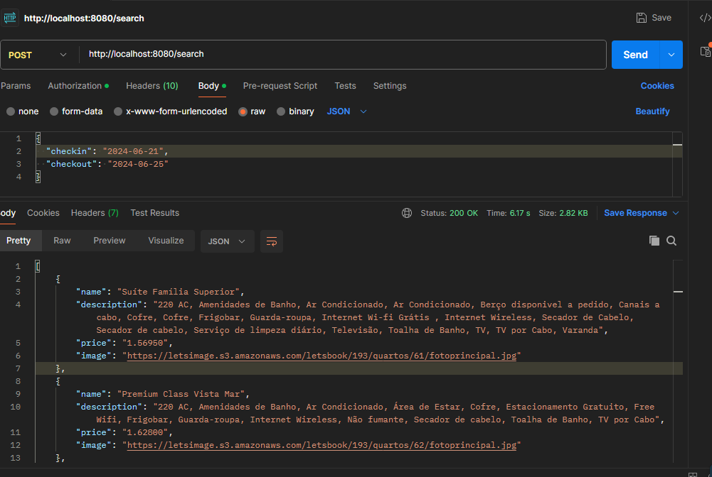

# Teste da Asksuite

https://bitbucket.org/paveisistemas-ondemand/asksuite-test-dev/src/master/

Test Dev Asksuite
Hey! Glad you're here. I'm going to explain exactly what you'll have to implement in this test and what we expect as outcome.

First of all, we have this nice express.js boilerplate project to assist you so you don't have to create everything from scratch.

Briefing
The traveller comes to our bot and asks for "Price quotation". Then the bot asks for the dates the traveller wants to stay at the bot's hotel. At the moment the traveller fills the requested information the bot needs to search the prices for each room available in the check-in/check-out timeframe.

You will have to implement the API responsible for doing the searching part. The necessary information for the crawler is under the Assets session

What you'll need to do:
Create a POST endpoint "/search"

The expected payload is:

{
    "checkin": "YYYY-MM-DD", // Check-in date
    "checkout": "YYYY-MM-DD" // Check-out date
}
Example

<pre>
{
    "checkin": "2021-07-01", 
    "checkout": "2021-07-03"
}
</pre>
The expected result is an array of rooms:

[{
    "name": string, // Room name
    "description": string,  // Room description
    "price": string, // Room daily price
    "image": string, // Room main photo
}]
Example

[{
    "name": "STUDIO CASAL",
    "description": "Apartamentos localizados no prédio principal do Resort, próximos a recepção e a área de convivência, com vista para área de estacionamento não possuem varanda. Acomoda até 1 adulto e 1 criança ou 2 adultos", 
    "price": "R$ 1.092,00",
    "image": "https://letsimage.s3.amazonaws.com/letsbook/193/quartos/30/fotoprincipal.jpg"
},
{
    "name": "CABANA",
    "description": "Apartamentos espalhados pelos jardins do Resort, com vista jardim possuem varanda. Acomoda até 4 adultos ou 3 adultos e 1 criança ou 2 adultos e 2 criança ou 1 adulto e 3 crianças, em duas camas casal.", 
    "price": "R$ 1.321,00",
    "image": "https://letsimage.s3.amazonaws.com/letsbook/193/quartos/32/fotoprincipal.jpg"
}]
To achieve this result you may:

With puppeteer, go to the given URL
Retrieve the needed information to assemble the payload using web crawling methods
Environment
Node 10+
Dotenv setup
Already installed: express puppeteer dotenv

Feel free to add any lib you find relevant to your test.

Running
Install dependencies with: npm install
Run as dev: npm run dev
Default port is set to 8080

Assets
Crawl URL sample (change dates):
https://pratagy.letsbook.com.br/D/Reserva?checkin=21%2F06%2F2022&checkout=25%2F06%2F2022&cidade=&hotel=12&adultos=2&criancas=&destino=Pratagy+Beach+Resort+All+Inclusive&promocode=&tarifa=&mesCalendario=6%2F14%2F2022
Help images: sample_1
Test rating
What do we evaluate with this test?

Dev's capacity of:
Self-learning
Working with node
Understanding an existent project
Dev's code quality:
Clear and maintainable code
Coding structure
Changes that don't break easily


1. **.env**: Crie um arquivo `.env` contendo a variável: `PORT=8080`.
2. **Instalação**: Execute `npm install` para instalar todas as dependências necessárias.
3. **Execução**: Use `npm run dev` para iniciar o servidor em modo de desenvolvimento na porta 8080.

# Como Usar

Após iniciar o servidor, faça requisições POST para `/search` com o payload JSON a seguir para receber uma lista de quartos e preços disponíveis:

```json
{
  "checkin": "YYYY-MM-DD",
  "checkout": "YYYY-MM-DD"
}
```

Exemplo de requisição usando cURL:

```bash
curl -X POST http://localhost:8080/search -H "Content-Type: application/json" -d '{"checkin": "2024-06-21", "checkout": "2024-06-25"}'
```

## Resultado do Postman



## Testes

Execute `npm test` para rodar os testes automatizados.

## Pensamentos

Aqui estão algumas ideias que tive durante o desenvolvimento do projeto:

1. Para facilitar a expansão futura da API, os parâmetros da URL de requisição são montados dinamicamente usando `URLSearchParams`, o que permite a fácil inclusão de novos parâmetros sem alterar a base do código:

```js
const queryParams = new URLSearchParams({
  checkin: encodeURIComponent(checkin),
  checkout: encodeURIComponent(checkout),
  cidade: "",
  hotel: hotel,
  adultos: adultos,
  criancas: "",
  destino: destino,
  promocode: "",
  tarifa: "",
  mesCalendario: "7/14/2023",
});
```

2. Utilizei o `encodeURIComponent` para garantir que os dados enviados em URLs sejam transmitidos de forma correta e segura, prevenindo ataques de Cross-Site Scripting (XSS).

3. Para os testes, utilizei `Jest` em conjunto com `Supertest`. Jest gerencia a execução dos testes e as asserções, enquanto Supertest lida com as requisições HTTP.
