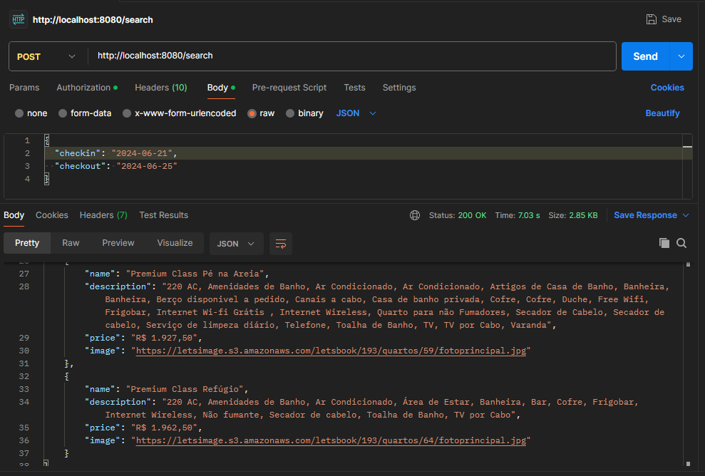

# Como Instalar e Executar

1. **.env**: Crie um arquivo `.env` contendo a variável: `PORT=8080`.
2. **Instalação**: Execute `npm install` para instalar todas as dependências necessárias.
3. **Execução**: Use `npm run dev` para iniciar o servidor em modo de desenvolvimento na porta 8080.

# Como Usar

Após iniciar o servidor, faça requisições POST para `/search` com o payload JSON a seguir para receber uma lista de quartos e preços disponíveis:

```json
{
  "checkin": "YYYY-MM-DD",
  "checkout": "YYYY-MM-DD"
}
```

Exemplo de requisição usando cURL:

```bash
curl -X POST http://localhost:8080/search -H "Content-Type: application/json" -d '{"checkin": "2024-06-21", "checkout": "2024-06-25"}'
```

## Resultado do Postman



## Testes

Execute `npm test` para rodar os testes automatizados.

## Pensamentos

Aqui estão algumas ideias que tive durante o desenvolvimento do projeto:

1. Para facilitar a expansão futura da API, os parâmetros da URL de requisição são montados dinamicamente usando `URLSearchParams`, o que permite a fácil inclusão de novos parâmetros sem alterar a base do código:

```js
const queryParams = new URLSearchParams({
  checkin: encodeURIComponent(checkin),
  checkout: encodeURIComponent(checkout),
  cidade: "",
  hotel: hotel,
  adultos: adultos,
  criancas: "",
  destino: destino,
  promocode: "",
  tarifa: "",
  mesCalendario: "7/14/2023",
});
```

2. Utilizei o `encodeURIComponent` para garantir que os dados enviados em URLs sejam transmitidos de forma correta e segura, prevenindo ataques de Cross-Site Scripting (XSS).

3. Para os testes, utilizei `Jest` em conjunto com `Supertest`. Jest gerencia a execução dos testes e as asserções, enquanto Supertest lida com as requisições HTTP.
